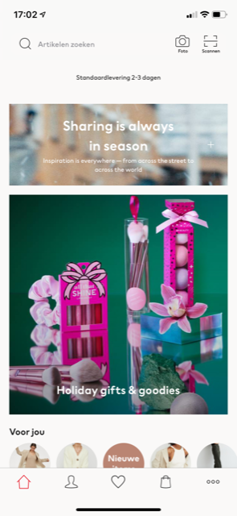
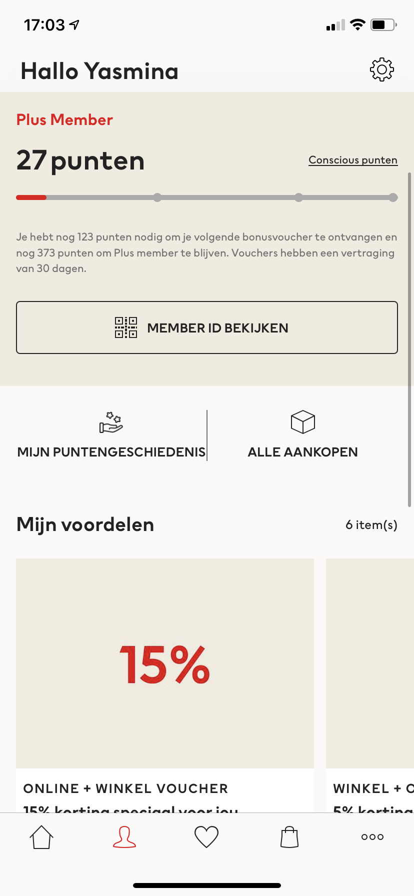

# Procesverslag
Markdown is een simpele manier om HTML te schrijven.  
Markdown cheat cheet: [Hulp bij het schrijven van Markdown](https://github.com/adam-p/markdown-here/wiki/Markdown-Cheatsheet).

Nb. De standaardstructuur en de spartaanse opmaak van de README.md zijn helemaal prima. Het gaat om de inhoud van je procesverslag. Besteedt de tijd voor pracht en praal aan je website.

Nb. Door *open* toe te voegen aan een *details* element kun je deze standaard open zetten. Fijn om dat steeds voor de relevante stuk(ken) te doen.

## Jij

uitwerken voor kick-off werkgroep

### Auteur:
Yasmina Rietkerk

#### Je startniveau:
Rode piste

#### Je focus:
Surface plane
 

## Je website

uitwerken voor kick-off werkgroep

### Je opdracht:
De website van de H&M. www.hm.com 

#### Screenshot(s) van de eerste pagina (small screen): 
Startpagina

#### Screenshot(s) van de tweede pagina (small screen):
Punten 

 

## Breakdownschets (week 1)

uitwerken na afloop 2e werkgroep

### de hele pagina: 

### dynamisch deel (bijv menu): 

### wellicht nog een dynamisch deel (bijv filter): 

## Voortgang 1 (week 2)

uitwerken voor 1e voortgang

### Stand van zaken
Voor de eerste voortgang was ik nog niet heel ver met mijn website. Ik had het grootste gedeelte van mijn HTML en de indeling van de CSS. Dat was allemaal goed gelukt.
Ik had moeite met het selecteren van de juiste sections. Ik wilde 1 image selecteren, maar dat lukte niet.

### Agenda voor meeting
samen met je groepje opstellen

| Yasmina        | Cheun              | Selina       | student 4        |
| ---            | ---                | ---          | ---              |
| Hoe selecteer  | en dit             | en ik dit    | en dan ik dat    |
| ik de juiste   | dit als er tijd is | nog een punt | dit wil ik zeker |
| img?           | ...                | ...          | ...              |

### Verslag van meeting
hier na afloop snel de uitkomsten van de meeting vastleggen

- met section:nth-of-type(1) img selecteer je de image uit de eerste section.
- Met transform: skew(-10deg) maak je een element schuin (mijn mooie vrachtwagentje).
- Met ::after zorg je dat een element ergens na komt en met ::before zorg je dat een element ergens
  voor komt. Hiervoor moet je altijd content gebruiken.

## Voortgang 2 (week 3)

uitwerken voor 2e voortgang

### Stand van zaken
Ik heb een font gekozen (Avenir) en ik heb mijn nav gemaakt. Dit ging best goed. Ik heb hierbij hulp gehad van een klasgenoot, de code van de humpty opdracht gebruikt en dingen gezocht op internet en de nav werkt nu.
Het enige probleem is, als je de nav sluit dan zie je alle elementen verschuiven. Dit hoort niet. 

### Agenda voor meeting
samen met je groepje opstellen

| Yasmina                                 | student 2          | student 3    | student 4        |
| ---                                     | ---                | ---          | ---              |
| Line break in css                       | en dit             | en ik dit    | en dan ik dat    |
| Ruimte tussen foto's smaller maken      | dit als er tijd is | nog een punt | dit wil ik zeker |
| Opacity wijzigen als de nav open gaat.  | ...                | ...          | ...              |

### Verslag van meeting
hier na afloop snel de uitkomsten van de meeting vastleggen

- punt 1
- punt 2
- nog een punt
- ...

## Toegankelijkheidstest (week 4)

uitwerken na test in 8e voortgang

### Bevindingen
Lijst met je bevindingen die in de test naar voren kwamen:

#### Titel eerste bevinding
Hier korte omschrijving (met indien nodig een afbeelding)

Hier een omschrijving van hoe het opgelost kan worden (met indien nodig een afbeelding)

#### Titel tweede bevinding. 
Hier korte omschrijving (met indien nodig een afbeelding)

Hier een omschrijving van hoe het opgelost kan worden (met indien nodig een afbeelding)

#### Titel volgende bevinding. 
Hier korte omschrijving (met indien nodig een afbeelding)

Hier een omschrijving van hoe het opgelost kan worden (met indien nodig een afbeelding)

#### Titel nog een bevinding. 
Hier korte omschrijving (met indien nodig een afbeelding)

Hier een omschrijving van hoe het opgelost kan worden (met indien nodig een afbeelding)

## Voortgang 3 (week 4)

uitwerken voor 3e voortgang

### Stand van zaken
hier dit ging goed & dit was lastig (neem ook screenshots op van delen van je website en code)

### Agenda voor meeting
samen met je groepje opstellen

| student 1      | student 2          | student 3    | student 4        |
| ---            | ---                | ---          | ---              |
| dit bespreken  | en dit             | en ik dit    | en dan ik dat    |
| en dat ook nog | dit als er tijd is | nog een punt | dit wil ik zeker |
| ...            | ...                | ...          | ...              |

### Verslag van meeting
hier na afloop snel de uitkomsten van de meeting vastleggen

- punt 1
- punt 2
- nog een punt
- ...

## Eindgesprek (week 5)

uitwerken voor eindgesprek

### Stand van zaken
hier dit ging goed & dit was lastig (neem ook screenshots op van delen van je website en code)

### Screenshot(s)

hier screenshot(s) van je eindresultaat

## Bronnenlijst

continu bijhouden terwijl je werkt

Nb. Wees specifiek ('css-tricks' als bron is bijv. niet specifiek genoeg).

1. bron 1
2. bron 2
3. ...

